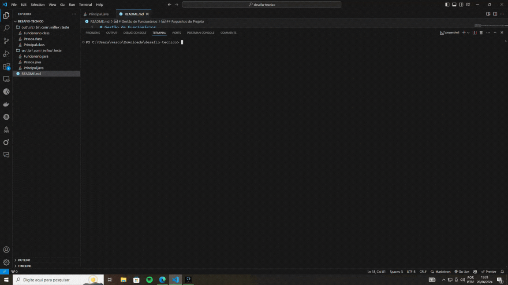

# Gestão de Funcionários

Este projeto em Java consiste em um sistema simples para gerenciar informações de funcionários em uma empresa, seguindo requisitos específicos.

<div align="center">

</div>

## Requisitos do Projeto

1. **Classe Pessoa e Funcionário**: 
   - A classe `Pessoa` possui os atributos `nome` (String) e `dataNascimento` (LocalDate).
   - A classe `Funcionario` estende `Pessoa` e adiciona os atributos `salario` (BigDecimal) e `funcao` (String).

2. **Operações Implementadas**:
   - Inserir funcionários com informações específicas.
   - Remover um funcionário específico da lista.
   - Imprimir funcionários com formatação adequada para nome, data de nascimento (dd/mm/aaaa), salário (formatado com separador de milhar e vírgula) e função.
   - Calcular e aplicar aumento de 10% no salário dos funcionários.
   - Agrupar funcionários por função em um mapa e imprimir os grupos.
   - Identificar e imprimir funcionários que fazem aniversário nos meses de outubro e dezembro.
   - Identificar e imprimir o funcionário mais velho, exibindo seu nome e idade.
   - Imprimir a lista de funcionários em ordem alfabética.
   - Calcular e imprimir o total dos salários dos funcionários.
   - Calcular e imprimir quantos salários mínimos cada funcionário ganha, considerando que o salário mínimo é R$ 1.212,00.

## Como Executar

Para compilar e executar o projeto, siga os passos abaixo:

### Compilação

Certifique-se de estar na raiz do projeto e execute os seguintes comandos para compilar os arquivos fonte Java:

```bash
javac -encoding UTF-8 -d out src/*.java
```

Este comando compila todos os arquivos `.java` da pasta `src`.

### Execução

Após compilar, execute o projeto com o seguinte comando:

```bash
java -cp out src.Principal
```

Este comando executa a classe `Principal` que contém o método `main`, iniciando o programa e exibindo os resultados conforme os requisitos do desafio.

## Configuração de Codificação UTF-8

Foi usado para resolver os problemas com caracteres especiaisda linguagem portuguesa. 
